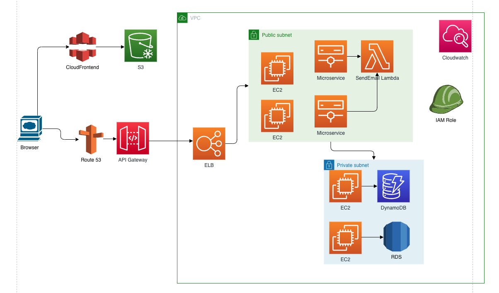

# Designing and Simulating AWS Cloud Architectures

#### Part 1: Designing Cloud Infrastructure

Para una infraestructura utilizando a AWS como nuestro proveedor en la nube, usaremos la siguiente infraestructura:

- CloudFronted
- S3
- Route 53
- API Gateway
- Virtual Private Cloud
- Elastic Load Balancing
- Elastic Compute Cloud
- Lambda
- DynamoDB
- Relational Database Service
- CloudWatch
  

#### Part 2: IAM Configuration

Debemos crear diferentes roles para asignar diferentes politicas a quienes daran uso de la infraestructura.

- Developer: Rol con politicas que tengan permisos limitados solo para realizar sus tareas de desarrollo. Ejemplo acceso a visualizar Cloudwatch para verificar errores, envio al S3 para los archivos estaticos de frontend, etc.
- Administrador: Rol que tenga permisos para realizar tareas de despliegue y mantenimiento.
- Aplicacion: Rolo para EC2 pueda ejecutar tareas con RDS, DynamoDB, invocacion Lambda.

#### Part 3: Resource Management Strategy

- Para la parte de mantenimiento de recursos, se configurara el autoescalamiento para asi evitar que se consuma recursos demas que son traducidos a costos extras.
- Dispondremos de un balanceador para evitar que el autoescalamiento haga que una instancia aumente en recursos si existe otra instancia sin utilizar.
- Utlizar AWS Budgets y AWS Cost Explorer para vigilar como van los gastos.

#### Part 4: Theoretical Implementation

Para la implementacion inciaremos desde el primer punto de entrada:

- Para apoyar al frontend con archivos estaticos que son utilizados, dispondremos de un CDN que consulte un S3 para la obtencion de dichos archivos.
- Al realizar consultas ya hacia la infraestructura utilizaremos el servicio de Route 53 para el manejo de dominios el cual nos dirija al punto de entrada, el cual es brindado por el servicio API Gateway.
- Tendremos un balanceador el cual orquestrara a que instancia de EC2 usara para despues llegar al microservicio a realizar el servicio solicitado.
- Tendremos una subred privada para la parte de acceso a EC2 donde se encuentra nuestra informacion mas importante, base de datos.
- En este caso agregamos de ejemplo el uso de una Lambda para el envio del correo, ya que este puede correr de manera asincronica a todo el flujo.
- Tendremos a disposicion de Cloudwatch para vigilar los errores que se puedan presentar durante tiempo de ejecucion.

#### Part 5: Discussion and Evaluation

El manejar una infraestructura en la nube nos facilita mucho el desplegar una aplicacion ya sea simple o muy compleja. Dispone de muchos servicios a nuestras manos para poder elegir la mejor manera de tener nuestra infraestructura.
Tener en una pagina web, incluso el uso de Terraform para la generacion de nuestra estructura, escalarla, modificarla me parece fantastico.
No conocia muchos de estos servicios, ya que anteriormente solo habia utilizado Azure como proveedor de la nube, pero me parece muy interesante cada uno de los que AWS nos provee.
