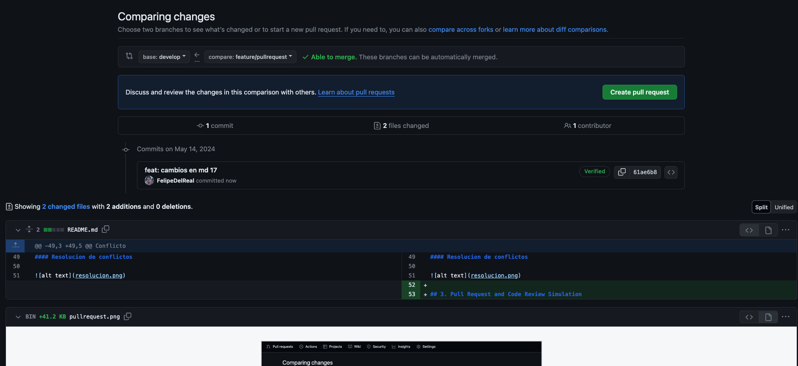

# Tasks

## 1. Branch Strategy Simulation

### Trun Based Development

#### Commit directo a main

#### Push de cambios

### Gitflow

#### Creacion de branch develop

#### Creacion de branch feature

#### Commits en feature

#### Merge feature a develop

#### Creacion rama release

#### Merge release a main

## 2. Conflict Resolution and Merging

Hubo conflicto y tomamos _Incomming change_ ya que contaba con la informacion que requeriamos
Conflicto

#### Resolucion de conflictos

## 3. Pull Request and Code Review Simulation

