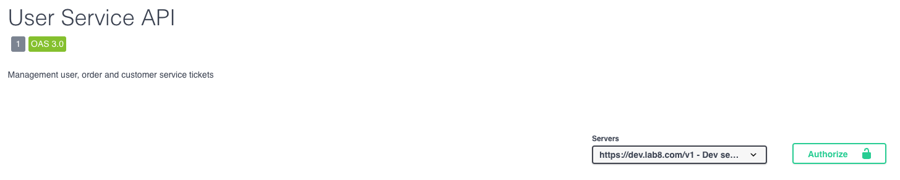
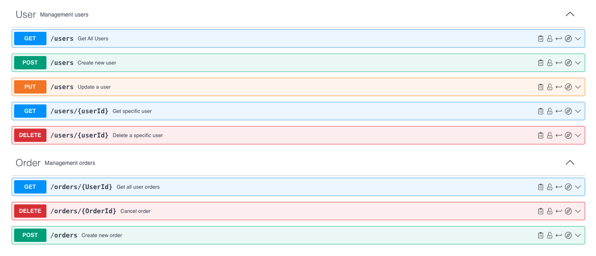
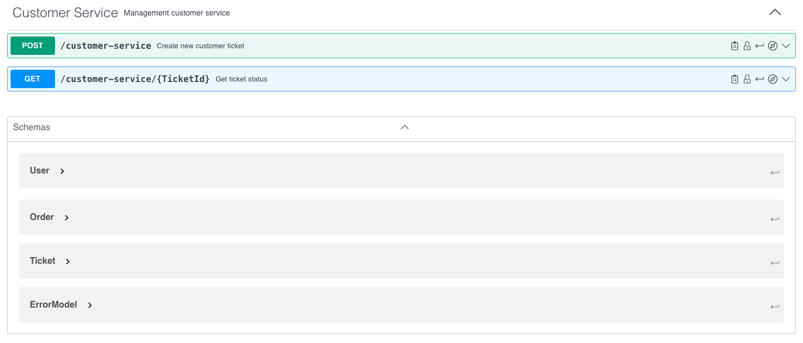
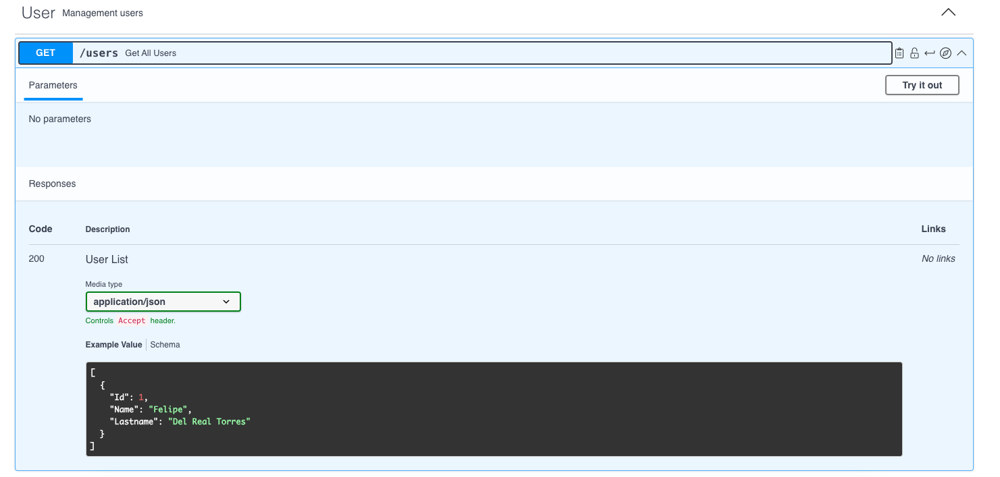

#### API Specifications Document:

- A complete and detailed SwaggerHub API specification that includes: - Descriptions of all endpoints. - Definitions of request and response parameters. - Detailed resource models. - Enumeration of potential error codes and their meanings.
  Se agrega link e imagenes del archivo Swagger
  [Swagger Hub](https://app.swaggerhub.com/apis/FELIPEDELREAL/Delivery/1)
  [Swagger API Local](swagger.yaml)
  
  
  

Ejemplo de API

#### Reflection Report:

- A brief report where participants reflect on their design process, discussing:
  - The challenges they faced during the API design.
    - El desafio principal fue revisar en la documentacion la manera en como acomodar en formato YAML los tags que queria agregar, ya que no cuento con mucha experiencia en generar la documentacion directa y asu vez tampoco con YAML.
  - How they applied API First principles to ensure the API was robust and aligned with business needs.
    - Se utilizo el uso de sustantivos para los paths de los API para que fueran consistentes, el uso de los verbos HTTP Methods junto con el manejo del uso de diferetes HTTP Status Code para los errores que regresaremos. Descripcion sencilla, no tecnica en las descripciones y proporcionar ejemplos de valores de entrada y salida.
  - Insights gained from the exercise and potential improvements they could make in future API design projects.
    - Manejar la documentacion de una manera mas organizada y estandarizada para ahorrar tiempos a la hora de la entrega de los desarrollos. Ya que esto permitira el evitar sesiones y documentaciones extras para tener que explicar ya sea un nuevo endpoint o modificaciones.
